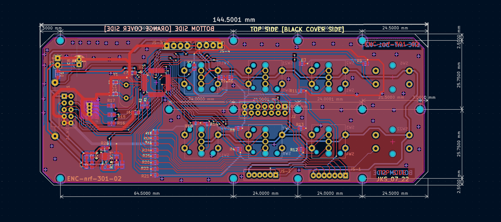

# Overhead-Crane-Control-System
An efficient and reliable embedded system firmware for overhead crane applications. Developed using STM32G030C8T6 MCU, this project presents a specialized solution for encoder and decoder units, tailored to enhance the performance and safety of crane operations. The project firmware comprises three fundamental components: the encoder unit (remote control), the decoder unit (crane control system), and the EEPROM configuration software.

## Decoder Unit

This code serves as the core control unit for an overhead crane system, managing bidirectional communication between master and slave devices using the NRF905 module. It detects the device's operational mode based on the state of the `MODE_Pin` and initializes the NRF905 module, shift registers, and relays during startup. The NRF905 module constantly listens for incoming data, with a rising edge on the `DR_Pin` indicating data reception. Upon receiving specific patterns like `0x40000000`, it activates the NRF905 module and the system eventually, while `0x80000000` sets the receiver state to standby and turns off the system. Relay states are updated through shift registers to control crane operations.

Additionally, the code utilizes timer interrupts to enhance control. The `HAL_TIM_Base_Start_IT(&htim3)` function initiates timer 3 and enables its interrupts, allowing for precise timing operations. Timer interrupts can be used for various purposes within the code, such as coordinating time-sensitive tasks or ensuring precise timing for specific crane operations.

The code not only manages data reception and relay control but also implements crucial button toggle and interlock features. Button presses, particularly those involving button 3, are monitored and toggled through the `button3_state` variable. Interlock functionality is achieved by clearing relay bits associated with buttons 5 and 6 if both buttons are pressed simultaneously. These 2 functionalities are often used in overhead cranes for numerous applications apart from normal relay actuation.

## Encoder Unit

The encoder unit interfaces with a set of buttons representing different crane functions, such as movement and relay control. The system relies on the NRF905 wireless module for communication between the encoder unit and the crane's decoder unit. The encoder unit continuously monitors the state of these buttons and generates a 32-bit pattern based on the button configuration. This pattern is then transmitted using the NRF905 module to the decoder unit, allowing it to interpret and execute the corresponding crane operations.

The encoder unit also incorporates timer interrupts, which are crucial for efficient button polling and data transmission. Timer interrupts ensure that button states are checked periodically, preventing excessive data transmission while maintaining responsiveness to button presses. Additionally, the code includes logic for switching on and off specific crane functions based on the received data, enabling the operator to control various aspects of the crane's operation remotely. Overall, the encoder unit plays a vital role in facilitating remote crane control, ensuring safety and precision in crane operations, and enhancing the efficiency of overhead crane systems.

Additionally, I also worked towards the development of the two-sided encoder unit PCB as seen below: 
### PCB of the Encoder Unit

## EEPROM Configuration

The provided code serves as a critical component for configuring the decoder unit, facilitating the mapping of each key on the encoder to its respective relay on the decoder. This functionality is essential in scenarios where customization and flexibility are paramount, such as when an original equipment manufacturer (OEM) needs to provide a system that can adapt to the unique button-to-relay configurations of multiple clients. The code enables the OEM to initialize and manage memory structures that store the configuration data for different keys and sectors within the decoder. It supports both default settings and runtime customization of these configurations through AT commands received via UART.

The code's working involves several key aspects. First, it initializes the memory with default values for each key and sector, ensuring a consistent starting point. Second, it processes AT commands sent over UART to customize the configuration, allowing the OEM or clients to modify the relay assignments for specific keys dynamically. Third, it employs Flash memory to store these configurations persistently, ensuring that the settings are retained even after power cycles. Lastly, it provides feedback to the user or clients through debug messages sent over UART, facilitating troubleshooting and verification of the configurations. This code serves as a robust and adaptable solution for managing button-to-relay mappings in a versatile and client-specific manner, making it highly valuable for the OEM's system customization needs.

